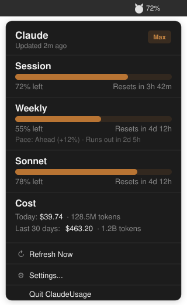
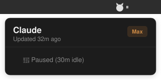

# ClaudeUsage

**A native macOS menu bar app that monitors your Claude Code usage in real time.**

<p align="center">
  
  
  
  
</p>

<p align="center">
  <a href="README.md">🇨🇳 中文文档</a>
</p>

<p align="center">
  
  &nbsp;&nbsp;&nbsp;
  
</p>

## Why ClaudeUsage?

Claude Max plan has session (5-hour) and weekly (7-day) usage limits, but there's no easy way to check how much you've consumed without opening the CLI and running `/usage`. ClaudeUsage sits quietly in your menu bar and shows the percentage at a glance — plus pace predictions, reset countdowns, and cost tracking.

## Inspired by CodexBar

This project was inspired by [CodexBar](https://github.com/steipete/CodexBar) — a feature-rich multi-provider AI usage dashboard by Peter Steinberger. We're grateful for CodexBar's pioneering work in this space. ClaudeUsage takes a different approach, optimizing specifically for Claude Code users who value simplicity and security.

| | ClaudeUsage | CodexBar |
|---|---|---|
| **Data source** | Official CLI `/usage` — Anthropic's own numbers | OAuth API / CLI PTY / browser cookies |
| **Security** | Zero network calls, no Keychain, no credentials | Keychain + API auth |
| **App size** | < 1 MB, zero dependencies | ~50 MB, multiple frameworks |
| **Min macOS** | 13 (Ventura) | 14 (Sonoma) |
| **Scope** | Claude Code (focused) | 20+ AI providers |
| **Pace prediction** | ✅ | — |
| **Idle detection** | ✅ IOKit | — |
| **Desktop widget** | ✅ Frosted glass | ✅ WidgetKit |
| **Cost chart / CLI / Linux** | — | ✅ |

**Choose ClaudeUsage** for a lightweight, focused Claude monitor. **Choose CodexBar** for a multi-provider dashboard.

## Features

### Usage Monitoring
- **Menu bar indicator** — a cat icon 🐱 with your current session usage percentage, always visible
- **Session limit** — 5-hour rolling window usage with progress bar
- **Weekly limit** — 7-day usage with progress bar (all models + Sonnet breakdown)
- **Reset countdown** — real-time "Resets in 2d 5h" countdown for each limit

### Pace Prediction
- **Ahead / Behind** — compares your actual consumption to linear expected pace
- **Run-out estimate** — if you're consuming too fast, shows when you'll hit the limit (e.g. "Runs out in 1d 3h")

### Cost Tracking
- Scans `~/.claude/projects/**/*.jsonl` session logs locally
- Per-model pricing for Opus 4.5/4.6, Sonnet 4.5/4.6, Haiku, and legacy models
- Tiered pricing support (Sonnet 200K+ token threshold)
- Shows **today's cost** and **last 30 days** with token counts
- Message deduplication by `message.id` (streaming produces cumulative lines)

### Desktop Widget
- **Floating widget** — a frosted-glass widget that sits on your desktop, always visible across all Spaces
- **Two sizes** — Small (compact 180×190 block) or Medium (320×140 with full details)
- **Fresh color palette** — ocean blue (session), coral pink (weekly), mint green (cost), warm purple (branding)
- **Draggable** — drag to any position, remembered across launches
- **Zero overhead** — shares the same data store as the menu bar; no extra polling or IPC

### Smart Idle Detection
- Polls system idle time via IOKit `HIDIdleTime` every 15 seconds
- When idle threshold is reached, pauses all polling and shows ⏸ in menu bar
- Automatically resumes with immediate refresh when you return
- Configurable: 1 min, 5 min, 10 min, 30 min, 1 hour, or never

### Settings
- **Refresh interval** — 1m, 3m, 5m, 10m, 30m
- **Auto-sleep** — pause when idle (1m–1h, or never)
- **Display mode** — show remaining % or used %
- **Launch at login** — via SMAppService

## Architecture

```
┌─────────────────────────────────────────────────────────┐
│                    ClaudeUsageApp                        │
│              MenuBarExtra (.window style)                │
│         ┌──────────┐    ┌──────────────┐                │
│         │ Cat Icon │    │ Usage % Text │                │
│         └──────────┘    └──────────────┘                │
├─────────────────────────────────────────────────────────┤
│                      MenuBarView                        │
│  ┌──────────┬──────────┬──────────┬──────────────────┐  │
│  │ Session  │ Weekly   │ Sonnet   │  Cost Section    │  │
│  │ Block    │ Block    │ Block    │  Today / 30 Day  │  │
│  │ + Bar    │ + Bar    │ + Bar    │  $ + Tokens      │  │
│  │ + Reset  │ + Reset  │ + Reset  │                  │  │
│  │          │ + Pace   │          │                  │  │
│  └──────────┴──────────┴──────────┴──────────────────┘  │
├─────────────────────────────────────────────────────────┤
│                      UsageStore                         │
│        @MainActor, @Published properties                │
│  ┌────────────────┐  ┌──────────────────────┐           │
│  │  refreshTimer  │  │   idlePollTimer      │           │
│  │  (configurable)│  │   (every 15 sec)     │           │
│  └───────┬────────┘  └──────────┬───────────┘           │
│          │                      │                       │
│          ▼                      ▼                       │
│  ┌─── Task.detached ───┐  ┌─ checkIdleState() ─┐       │
│  │                     │  │ IOKit HIDIdleTime   │       │
│  │  UsageFetcher.fetch │  │ → pause / resume    │       │
│  │  UsageParser.parse  │  └─────────────────────┘       │
│  │  CostScanner.scan   │                               │
│  └─────────────────────┘                               │
└─────────────────────────────────────────────────────────┘

Data Sources:
┌────────────────────────┐    ┌──────────────────────────┐
│    Claude CLI (PTY)    │    │  ~/.claude/projects/     │
│  openpty → /usage cmd  │    │    **/*.jsonl            │
│  → ANSI strip + parse  │    │  → token cost scan       │
└────────────────────────┘    └──────────────────────────┘
```

### Data Flow

1. **Timer fires** → `UsageStore.refresh()` on main thread
2. **`Task.detached`** moves all heavy I/O off the main thread:
   - `UsageFetcher.fetch()` — spawns `claude --allowed-tools ""` via PTY, waits for welcome screen (600ms quiet), sends `/usage`, reads until stop strings detected
   - `UsageParser.parse()` — strips ANSI escape codes (including `ESC[NC` cursor-right → spaces), extracts percentages and reset times
   - `CostScanner.scan()` — walks `~/.claude/projects/` for JSONL files modified in last 30 days, extracts token usage per message, deduplicates by message ID, applies per-model pricing
3. **Back on main thread** — published properties update, SwiftUI re-renders

### File Structure

```
ClaudeUsage/
├── Package.swift              # SPM manifest (macOS 13+, Swift 5.9)
├── build.sh                   # Build + .app bundle assembly
├── Resources/
│   ├── Info.plist             # LSUIElement=YES (no dock icon)
│   └── AppIcon.icns           # Generated cat icon
├── Scripts/
│   └── make-icon.swift        # CoreGraphics icon generator
└── Sources/ClaudeUsage/
    ├── ClaudeUsageApp.swift   # @main, MenuBarExtra, NSImage cat icon
    ├── MenuBarView.swift      # SwiftUI popup UI, pace calculation
    ├── UsageStore.swift       # State management, timers, idle detection
    ├── UsageFetcher.swift     # PTY-based CLI interaction (actor)
    ├── UsageParser.swift      # ANSI stripping, % and reset parsing
    ├── UsageData.swift        # UsageSnapshot data model
    ├── CostScanner.swift      # JSONL log scanning, per-model pricing
    ├── DesktopWidget.swift    # Floating widget window (NSWindow + frosted glass)
    ├── WidgetViews.swift      # Small & Medium widget SwiftUI views
    └── Settings.swift         # UserDefaults, SMAppService
```

## Install

### Download (Recommended)

1. Download `ClaudeUsage.app.zip` from the [latest release](../../releases/latest)
2. Unzip and drag `ClaudeUsage.app` to `/Applications/`
3. Open it — the cat icon appears in your menu bar

### Build from Source

Requires **macOS 13+** and **Swift 5.9+** (Xcode 15 CLI tools or standalone Swift toolchain).

```bash
git clone https://github.com/pemagic/ClaudeUsage.git
cd ClaudeUsage
bash build.sh
cp -r ClaudeUsage.app /Applications/
open /Applications/ClaudeUsage.app
```

`build.sh` runs `swift build -c release`, generates the app icon, and assembles the `.app` bundle. No Xcode project needed.

## Usage

Once running, click the cat icon in your menu bar to see the popup:

- **Session** — your 5-hour rolling usage (e.g. "72% left · Resets in 3h 42m")
- **Weekly** — your 7-day usage with pace info (e.g. "Ahead (+12%) · Runs out in 2d 5h")
- **Sonnet** — Sonnet-specific usage if tracked separately
- **Cost** — today's and last 30 days' estimated cost and token count
- **Refresh Now** — trigger an immediate refresh
- **Settings** — configure refresh interval, idle threshold, display mode

When you stop using your Mac, the menu bar shows **⏸** and polling pauses. Move the mouse or press a key and it resumes automatically.

## Pricing Table

| Model | Input ($/MTok) | Output ($/MTok) | Cache Read | Cache Create |
|-------|:-:|:-:|:-:|:-:|
| Opus 4.5/4.6 | $5 | $25 | $0.50 | $6.25 |
| Opus 4.1 | $15 | $75 | $1.50 | $18.75 |
| Sonnet 4.5/4.6 | $3 | $15 | $0.30 | $3.75 |
| Sonnet (>200K) | $6 | $22.50 | $0.60 | $7.50 |
| Haiku 4.5 | $1 | $5 | $0.10 | $1.25 |

Prices aligned with Anthropic's published API pricing (Feb 2025).

## Technical Notes

- The CLI working directory is set to `/tmp/claudeusage-probe` to avoid macOS TCC permission dialogs for Desktop/Documents
- `env -u CLAUDECODE` prevents "nested session" errors when launched from within a Claude Code session
- The welcome screen can load 10KB+ of skill data before `/usage` output appears — the fetcher waits for 600ms of "quiet" rather than a fixed delay
- ANSI cursor-right codes (`ESC[1C`) in "current week" are replaced with spaces during stripping
- Cost scanning reads files line-by-line with C `fgets` for memory efficiency
- Sonnet tiered pricing (above 200K tokens) uses higher per-token rates

## Requirements

- macOS 13 Ventura or later
- [Claude Code CLI](https://docs.anthropic.com/en/docs/claude-code) installed and authenticated
- Claude **Max** plan (usage data is only available on Max)

## License

[MIT](LICENSE)
